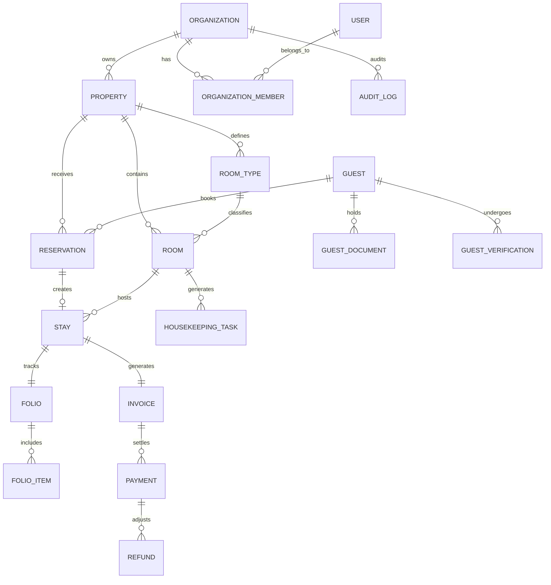

# StayFlow Database Design & Schema

## 1. Design Principles
1. **Normalized Relational Schema**: Built on PostgreSQL with referential integrity and foreign key constraints.
2. **UUID Primary Keys**: All entity IDs are standard RFC 4122 UUIDs generated server-side.
3. **UTC Timestamps Everywhere**: All `TIMESTAMP WITH TIME ZONE` columns store UTC internally. Conversion to property timezone occurs at the presentation/business calculation layer.
4. **Tenant Isolation**: High-frequency tables index `organization_id` or join through parent property records.
5. **Immutable Financial Snapshots**: Invoices snapshot room rates, extra hours, and folio item amounts so future rate changes never mutate past invoices.

---

## 2. Entity Relationship Overview

---

## 3. Core Tables

### 3.1 Organizations & Tenancy
- **`organizations`**: Tenant root. Fields: `id`, `name`, `slug`, `timezone`, `currency`, `created_at`, `updated_at`.
- **`properties`**: Individual guest houses/villas under an organization. Fields: `id`, `organization_id`, `name`, `address`, `city`, `country`, `timezone`, `active`.
- **`users`**: Platform users. Fields: `id`, `email`, `hashed_password`, `full_name`, `phone`, `is_active`, `fcm_token`.
- **`organization_members`**: User memberships in organizations. Fields: `id`, `organization_id`, `user_id`, `role` (`OWNER`, `MANAGER`, `RECEPTIONIST`, `HOUSEKEEPER`).

### 3.2 Rooms & Inventory
- **`room_types`**: Categories of rooms. Fields: `id`, `property_id`, `name`, `description`, `is_ac`, `max_guests`, `base_hourly_rate`, `base_day_use_rate`, `base_nightly_rate`, `base_daily_rate`, `extra_hour_rate`, `extra_guest_rate`.
- **`rooms`**: Physical rooms. Fields: `id`, `property_id`, `room_type_id`, `room_number`, `floor`, `max_guests`, `status`, `notes`.
  - Statuses: `AVAILABLE`, `RESERVED`, `OCCUPIED`, `CLEANING`, `MAINTENANCE`, `OUT_OF_SERVICE`.
- **`room_status_history`**: Audit trail of room transitions. Fields: `id`, `room_id`, `from_status`, `to_status`, `changed_by`, `notes`, `created_at`.
- **`amenities`** and **`room_amenities`**: Relational amenities (WiFi, Pool, Hot Water, TV, Balcony).

### 3.3 Guests & Identity
- **`guests`**: Guest profile. Fields: `id`, `organization_id`, `full_name`, `phone`, `email`, `date_of_birth`, `address`, `preferred_language`, `notes`.
- **`guest_documents`**: Private ID document metadata. Fields: `id`, `guest_id`, `document_type` (`NATIONAL_ID`, `PASSPORT`, `DRIVING_LICENSE`), `file_key`, `ocr_raw`, `ocr_confidence`, `document_number`, `full_name`.
- **`guest_verifications`**: Staff verification logs. Fields: `id`, `guest_id`, `document_id`, `status` (`PENDING`, `CONFIRMED`, `REJECTED`), `verified_by`, `verified_at`.

### 3.4 Reservations & Stays
- **`reservations`**: Future booking records. Fields: `id`, `reservation_number`, `property_id`, `room_id`, `primary_guest_id`, `stay_type` (`HOURLY`, `DAY_USE`, `OVERNIGHT`, `DAILY`), `check_in_date`, `expected_checkout_date`, `status`, `booking_source`, `advance_payment`.
  - Statuses: `PENDING`, `CONFIRMED`, `CHECKED_IN`, `COMPLETED`, `CANCELLED`, `NO_SHOW`.
- **`stays`**: Active physical occupancy. Fields: `id`, `reservation_id`, `property_id`, `room_id`, `primary_guest_id`, `stay_type`, `actual_check_in`, `expected_checkout`, `actual_checkout`, `num_guests`, `checked_in_by`, `checked_out_by`, `is_completed`.

### 3.5 Billing, Folios & Payments
- **`folios`**: Running itemized charges for an active stay. Fields: `id`, `stay_id`, `is_finalized`, `finalized_at`.
- **`folio_items`**: Line items during stay. Fields: `id`, `folio_id`, `category` (`FOOD`, `DRINK`, `MINIBAR`, `LAUNDRY`, `ROOM_SERVICE`, `OTHER`), `description`, `quantity`, `unit_price`, `total`, `created_by`.
- **`invoices`**: Final financial snapshot upon checkout. Fields: `id`, `invoice_number`, `stay_id`, `guest_id`, `room_charge`, `services_total`, `discount`, `tax`, `grand_total`, `is_finalized`.
- **`payments`**: Payment transactions settling an invoice. Fields: `id`, `invoice_id`, `payment_method` (`CASH`, `CARD`, `BANK_TRANSFER`, `QR`, `ONLINE`), `amount`, `reference`, `created_by`.
- **`refunds`**: Payment reversals. Fields: `id`, `payment_id`, `amount`, `reason`, `created_by`.

### 3.6 Housekeeping
- **`housekeeping_tasks`**: Cleaning workflows. Fields: `id`, `property_id`, `room_id`, `stay_id`, `assigned_to`, `status` (`PENDING`, `IN_PROGRESS`, `COMPLETED`), `priority` (`LOW`, `NORMAL`, `HIGH`, `URGENT`), `completed_at`.

### 3.7 Audit & Security
- **`audit_logs`**: System audit trail. Fields: `id`, `organization_id`, `user_id`, `action`, `entity_type`, `entity_id`, `old_values`, `new_values`, `ip_address`, `created_at`.
